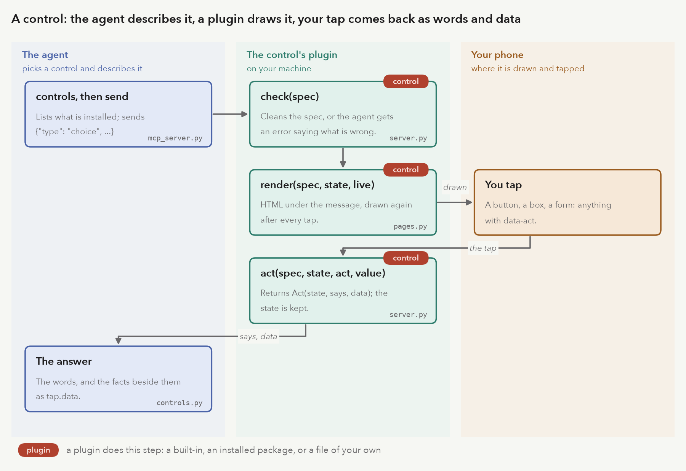

# Plugins

Every backend the service uses is a plugin of one kind, found and built the same way:

| kind | does | built-in |
|---|---|---|
| `control` | something an agent puts in front of the owner to tap: buttons, a checklist, anything a page can draw | `choice`, `checklist` |
| `tts` | the voice: turns a script into audio | `speechify`, `command`, `kokoro`, `kokoro-server` |
| `stt` | transcribes the owner's recordings | `command` |
| `rewrite` | turns a message into what the voice reads, and titles it | `identity`, `command`, `claude` |
| `notify` | reaches the owner when a message is ready, or goes unanswered | `push`, `imessage` |
| `phone` | carries a live call (see [voice-calls.md](voice-calls.md)) | none yet |

`nanotea plugins` lists every plugin of every kind and marks the ones the config uses. `nanotea plugins --options`
adds each plugin's keys, with what they take and their defaults. `nanotea plugins --check` builds the ones in use
as the service would and says what each offers, or why it failed (exit 1). Settings > Configuration in the app
shows the same for the running service: each plugin in use, its keys, where each value comes from, its secrets
(set or missing, never the value), and the others you could choose.

## Choosing one

A kind's table names its plugin with `backend`; the plugin's own settings are the table under it:

```toml
[tts]
backend = "piper"

[tts.piper]
voice_dir = "~/voices"
```

`notify` lists plugins instead: `now = ["push"]`, `escalate = ["imessage"]`, each with its own `[notify.<name>]`.
`control` lists them too: `use = ["choice", "checklist"]`, each with its own `[control.<name>]` if it has
settings. `use = []` turns controls off.

The name is one of:

- a built-in;
- a plugin an installed package registers under the entry point group `nanotea.<kind>`;
- `"module:Class"` for a module on the Python path. `plugin_path = ["plugins"]` at the top of the config adds
  directories (relative to the config's) to the path, so a plugin can be one file beside the config.

A name that is both built-in and registered by a package stops the service: uninstall one. So do an unknown
name, a module that won't import, a plugin written for another plugin API, and a plugin missing what its kind
requires. Each error names the table and key to fix. Nothing falls back to another plugin.

## Writing one

A plugin is a class (or any callable) with `api = 1`, called as `Plugin(table, ctx)`:

- `table`: its config table, a dict (empty if the config has none).
- `ctx`, a `nanotea.plugins.Context`:
  - `kind`, `name`: what it was built as.
  - `env`: the secrets from `env_file`.
  - `owner`, `app_name`: from `[app]`.
  - `data`: the service's data directory.
  - `services`: what the service shares. `notify` plugins get `"push"`, the Web Push subscriptions.
  - `storage()`: a directory of the plugin's own, `data/plugins/<kind>-<name>/`, made on first use.
  - `need(table, key, type)`: `table[key]`, or a config error naming the table and key.
  - `secret(KEY)`: `env[KEY]`, or a config error saying to put it in `env_file`.

Raise `nanotea.config.ConfigError` from the constructor for settings the plugin can't use; the service won't
start, and `--check` prints the message. Anything that fails later, at work, raises: the message fails visibly
with the error, and the owner is told.

The first paragraph of the class's docstring is what `nanotea plugins` shows.

### Saying what it takes

A plugin that declares its keys gets them checked, listed on the Configuration page and in `nanotea plugins
--options`. Two optional class attributes:

```python
from nanotea.config import Option

class Tone:
    OPTIONS = (Option("hz", int, "The pitch of the tone.", 440, lo=20, hi=20000),
               Option("shape", str, "The wave.", "sine", choices=("sine", "square")))
    SECRETS = ("TONE_API_KEY",)                        # names in env_file the plugin needs; shown as set or missing
```

`Option(key, kind, about, default, choices=(), lo=None, hi=None)`: `kind` is the type (or a tuple of types) the
value has; leave `default` out for a required key, and give `None` for one that is simply not set. A key in the
table that no option names stops the service with `[tts.tone] has no key hz; keys are ...`. Declaring `OPTIONS`
does not validate values: the constructor still raises `ConfigError` for what it can't use. A plugin without
`OPTIONS` is accepted with any keys, and the Configuration page says it doesn't declare them. Every table under
a kind that no plugin in `backend` (or `now`, `escalate`, `use`) names is also checked: an unknown table name
stops the service.

### What each kind has

Required, checked when the plugin is built:

```python
class Tts:
    ext: str                                           # the audio synthesize writes: "mp3", "m4a", "wav", ...
    def voices(self) -> list[dict]: ...                # [{"id", "name"?, "gender"?, "locale"?}]; agents pick by id
    def synthesize(self, script: str, out: Path, voice: str) -> None: ...  # writes out; raises on failure

class Stt:
    def transcribe(self, audio: Path) -> str: ...      # any format the browser records: m4a, webm, ogg, wav

class Rewrite:
    def rewrite(self, text: str, sender: str, title_hint: str | None, ask: bool) -> Spoken: ...
    # nanotea.rewrite.Spoken(title, script). text is markdown; the voice reads script less its marks.

class Notify:
    def send(self, note: Note) -> None: ...            # nanotea.notify.Note: title, text, path, link, tag, unseen

class Phone:                                           # see voice-calls.md
    media: dict                                        # what the line carries both ways
    async def ring(self, to: str) -> Call: ...         # call the owner
    def calls(self) -> AsyncIterator[Call]: ...        # calls as they come in

class Control:
    name: str                                          # the type agents send: [a-z][a-z0-9-]{0,31}, unique
    about: str                                         # one line for agents: what it does and its spec
    def check(self, spec: dict) -> dict: ...           # the agent's spec, cleaned; ValueError says what's wrong
    def render(self, spec: dict, state: dict, live: bool) -> str: ...  # HTML; live False: takes no more taps
    def act(self, spec: dict, state: dict, act: str, value) -> Act: ...  # one tap; ValueError if it makes no sense
```

Optional for a control: `style` (CSS) and `script` (JavaScript). Each is added to every page once.
A script must listen on the document for events from inside `.control`, since controls are swapped in as the
owner taps.

Optional, for live calls. A plugin has all of a group or none of it:

```python
class Tts:
    stream_media: dict                                 # e.g. {"codec": "pcm_s16le", "rate": 24000, "channels": 1}
    def stream(self, script: str, voice: str) -> Iterator[bytes]: ...  # audio as it is made; stops when closed

class Stt:
    listen_media: dict                                 # the audio it takes
    def listen(self) -> Listening: ...                 # push(frames); yields partial, final and end-of-turn
```

Live audio is described as `{"codec": "pcm_s16le" | "pcm_mulaw" | "opus", "rate": Hz, "channels": n}`, checked
when the plugin is built.

### An example

One file beside the config, `plugins/tone.py`:

```python
import subprocess
from pathlib import Path

from nanotea.plugins import API


class Tone:
    """A test voice: a sine per voice, as long as the script is in words."""
    api = API
    ext = "wav"

    def __init__(self, cfg, ctx):
        self.hz = ctx.need(cfg, "hz", int)

    def voices(self):
        return [{"id": "low"}, {"id": "high"}]

    def synthesize(self, script: str, out: Path, voice: str) -> None:
        hz = self.hz * (2 if voice == "high" else 1)
        subprocess.run(["ffmpeg", "-nostdin", "-y", "-loglevel", "error", "-f", "lavfi", "-i",
                        f"sine=frequency={hz}:duration={len(script.split()) / 3}", str(out)], check=True)
```

```toml
plugin_path = ["plugins"]

[tts]
backend = "tone:Tone"

[tts."tone:Tone"]
hz = 440
```

### The two Kokoro voices

[Kokoro](https://github.com/hexgrad/kokoro) is an open text-to-speech model. Two built-ins speak with it:

- `kokoro` runs it inside the service, with no server. It needs the optional package (`uv sync --extra kokoro`,
  or `uv tool install 'nanotea[kokoro]'`) and the model files, about 350 MB, which only
  `nanotea kokoro download` fetches ([cli.md](cli.md#nanotea-kokoro-download)). It never downloads at start or when
  speaking: with the files missing or failing their SHA-256 check, the service won't start, and says to run the
  command. English voices only. The output is a mono wav at the model's own 24 kHz, as 32-bit float
  (`format = "float32"`, the model's samples as they are) or 24-bit (`"pcm24"`). It loads the model on first use,
  once, and speaks one message at a time.
- `kokoro-server` talks to a [Kokoro-FastAPI](https://github.com/remsky/Kokoro-FastAPI) server you run, such as
  the one in a container. Its voices are the server's, asked each time.

```toml
[tts]
backend = "kokoro"

[tts.kokoro]
# model_dir = "kokoro"   # default: ~/.cache/nanotea/kokoro; relative paths are the config's directory
# format = "float32"     # or "pcm24"
# speed = 1.0            # 0.5 to 2.0
```

```toml
[tts]
backend = "kokoro-server"

[tts.kokoro-server]
url = "http://127.0.0.1:8880"   # required
# model = "kokoro"          # the server's model name
# format = "wav"            # wav, flac, mp3, opus or aac; wav and flac are lossless
# speed = 1.0               # 0.25 to 4.0
# timeout_s = 600           # seconds before a request fails
```

### Built-in plugins' keys

A key marked required stops the service when it is missing; the others have the default shown. The example config (`nanotea/config.example.toml`) shows
each one in place.

| table | key | default | what it does |
|---|---|---|---|
| `[tts.speechify]` | `model` | required | Speechify model; only voices that support it are offered. Needs `SPEECHIFY_API_KEY` in `env_file` |
| | `timeout_s` | required | seconds before a request fails |
| `[tts.command]` | `argv` | required | the program and arguments; `{text_file}`, `{out}`, `{voice}` |
| | `ext` | required | the extension of the file the program writes |
| | `voices` | required | the voices senders may pick |
| | `timeout_s` | required | seconds before the program is killed |
| `[tts.kokoro]` | `model_dir` | `~/.cache/nanotea/kokoro` | where the model files are |
| | `format` | `float32` | `float32` or `pcm24` |
| | `speed` | `1.0` | 0.5 to 2.0 |
| `[tts.kokoro-server]` | `url` | required | the server's address |
| | `model`, `format`, `speed`, `timeout_s` | as above | `kokoro`, `wav`, 1.0 (0.25 to 4.0), 600 |
| `[stt.command]` | `argv` | required | prints the transcript of `{audio_file}`; `{package}` is where nanotea is installed |
| | `timeout_s` | required | seconds before it is killed |
| `[rewrite.command]` | `argv` | required | the LLM command line; `{system}`, `{system_file}`, `{schema_file}` |
| | `timeout_s` | required | seconds before it is killed |
| `[rewrite.claude]` | `command`, `model`, `effort`, `timeout_s` | required | the program, `--model`, `--effort`, seconds |
| `[notify.push]` | `subject` | required if used | the contact push services see: `mailto:` or `https://` with no port or path |
| `[notify.imessage]` | `to` | required if used | phone number or Apple ID email |

### The rewriter's instructions

`claude` and `command` send the rewriter instructions with each message: the built-in text is
`nanotea/rewrite_prompt.md`, with `{owner}` filled in from `[app] owner`. Settings > Configuration > Prompts shows
the text as sent, and lets the owner replace it. The replacement is kept in `data/prompts/rewrite.md` (written
whole, atomically), read on every message, so it takes effect at once and survives restarts; Reset deletes it and
the built-in applies again. It must be under 20000 characters and keep the `[[audio N]]` marker rule. Each change
is in the service log. The `identity` rewriter sends nothing, and the page says so.

### Controls



An agent sends a control with a message: `send(text, control={"type": "choice", "options": ["Ship", "Hold"]})`,
or `nanotea-tell --choice Ship --choice Hold "Ship it?"`. The service passes the spec to the plugin's `check`
and keeps what it returns. The page draws the control under the message with `render`, inside
`<div class="control">`.

When the owner taps an element inside it that has `data-act` (and `data-value`), or submits a form with
`data-act` (its fields are the value), the page posts the tap. The service calls `act` and keeps the state it
returns in the message's `control.json`, at most 64 KB of JSON. It then draws the control again and swaps it in.

`act` returns `nanotea.controls.Act(state, says, data)`:

- `state`: what the control remembers, for the next `render` and `act`.
- `says`: what the agent is told, in words. `None` tells it nothing yet: a tick on a checklist, before Done.
- `data`: facts beside the words, as JSON, which the agent gets as `tap.data`.

On a question still waiting, the words are the answer. Otherwise they go where a reaction would: the message's
channel, or the sender's line. The agent gets kind `tap`. Either way the item carries `tap: {control, data}`.

`render` must escape everything it draws from the spec: `nanotea.controls.e()` does it, and `button()` makes a
button that posts a tap. A control's HTML and script run in the owner's pages with the owner's access, so
install only controls you trust.

A rating control, one file beside the config:

```python
from nanotea.controls import Act, button, only
from nanotea.plugins import API


class Stars:
    """One to five stars; the agent gets the number."""
    api = API
    name = "stars"
    about = 'One to five stars; you get the number. {"type": "stars"}'

    def __init__(self, table, ctx):
        pass

    def check(self, spec):
        only(spec)
        return {"type": self.name}

    def render(self, spec, state, live):
        got = state.get("stars", 0)
        return "".join(button("\u2605" if n <= got else "\u2606", "rate", n, on=n == got, live=live)
                       for n in range(1, 6))

    def act(self, spec, state, act, value):
        n = int(value)
        if act != "rate" or not 1 <= n <= 5:
            raise ValueError("rate 1 to 5")
        return Act({"stars": n}, f"{n} of 5", {"stars": n})
```

```toml
plugin_path = ["plugins"]

[control]
use = ["choice", "checklist", "stars:Stars"]
```

### As a package

```toml
# the plugin package's pyproject.toml
[project.entry-points."nanotea.tts"]
piper = "nanotea_piper:Piper"
```

Install it beside nanotea (`uv tool install nanotea --with nanotea-piper`), then `backend = "piper"`.
